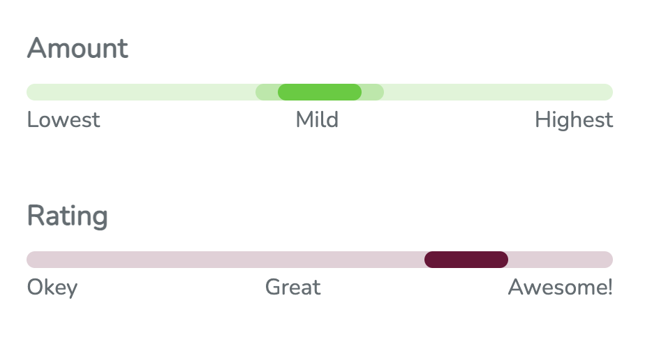

# react-info-meter

🌡️ A tiny react informative meter component with labels



## Installation

```
yarn add react-info-meter
```

## Usage

```JSX
import Meter from 'react-info-meter';

<Meter
    value={0}
    title="Median Home Value"
    legend={["Lowest", "Mild", "Highest"]}
/>
```
