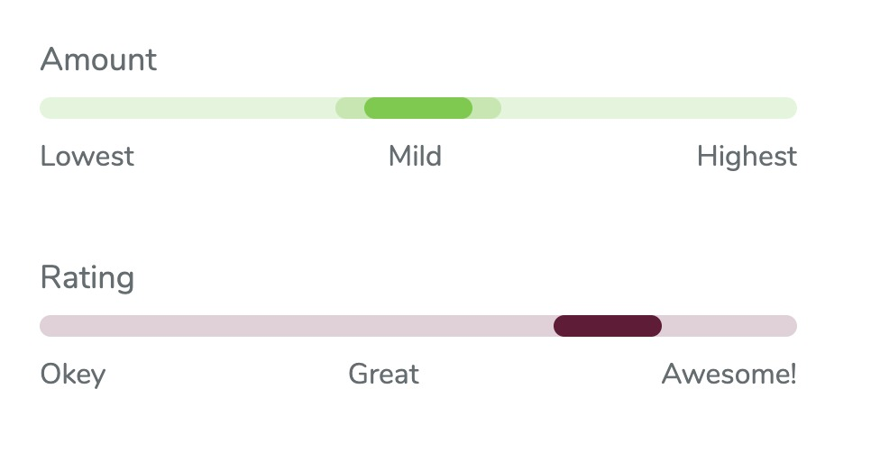

# react-info-meter

🌡️ A tiny react informative meter component with labels



## Installation

```
yarn add react-info-meter
```

## Usage

```JSX
    import Meter from 'react-info-meter';

    <Meter value={50}
        title="Amount"
        legend={["Lowest", "Mild", "Highest"]}
        baseColor="rgba(102, 200, 55, 0.2)"
        meterColor={{
            outer: 'rgba(102, 204, 55, 0.3)',
            inner: 'rgba(102, 204, 55, 1)'
        }}/>
```
